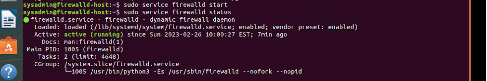
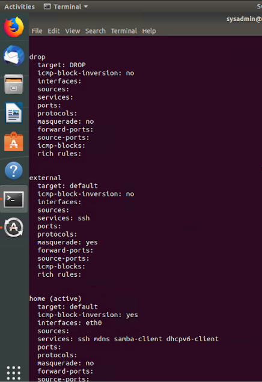
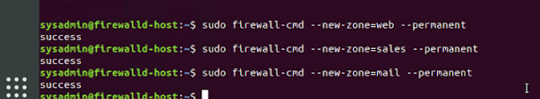
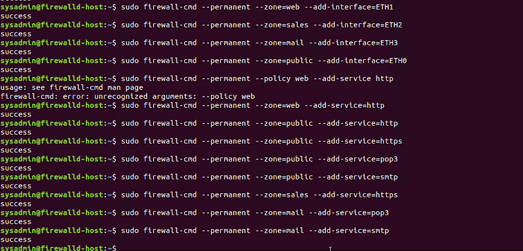
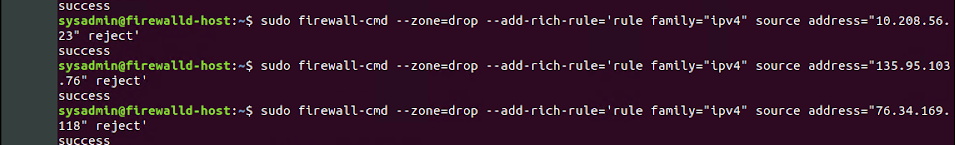
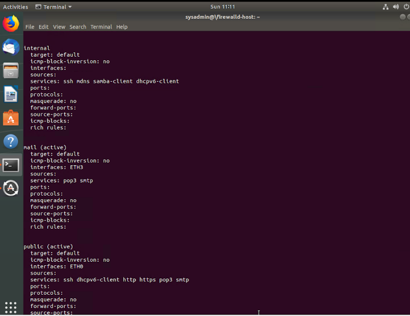

# PCI-DSS-Firewall-Project-
PCI/DSS Firewall Project                                                                                                                                    
         
The goal of this project is to strengthen a web server to comply with the first PCI/DSS regulation of configuring firewalls. The lab environment will involve a Linux VM (via HyperV Manager) within an Azure virtual network. Firewall configuration will be achieved through firewalld.  

Before getting started, we’ll verify that there’s not any instances of UFW running. This will avoid conflicts with our firewalld service                                                                                                                        

By default, the firewalld service should be running. If not, we’ll run the commands that enable and start firewalld upon boots and reboots
 

We’ll run sudo firewall-cmd --list-all-zones to see configured zones

 

Notice that there is a drop zone already configured, which will serve as a zone to block unwanted IP’s

We’ll create a web, sales and mail zone
   

Let’s also run the commands to set eth interfaces into the above zones, in addition to the permitted services.
 
 
We’ll need to add all current and any future blacklisted IPs to the drop zone.
 
To harden our network against ping scans, let’s block icmp ehco replies
 
 
Let’s run sudo firewall-cmd —-reload to view the updated zone. Use sudo firewall-cmd —-zone=drop --list-all-zones to view the updated rules to each zone!

 
   
